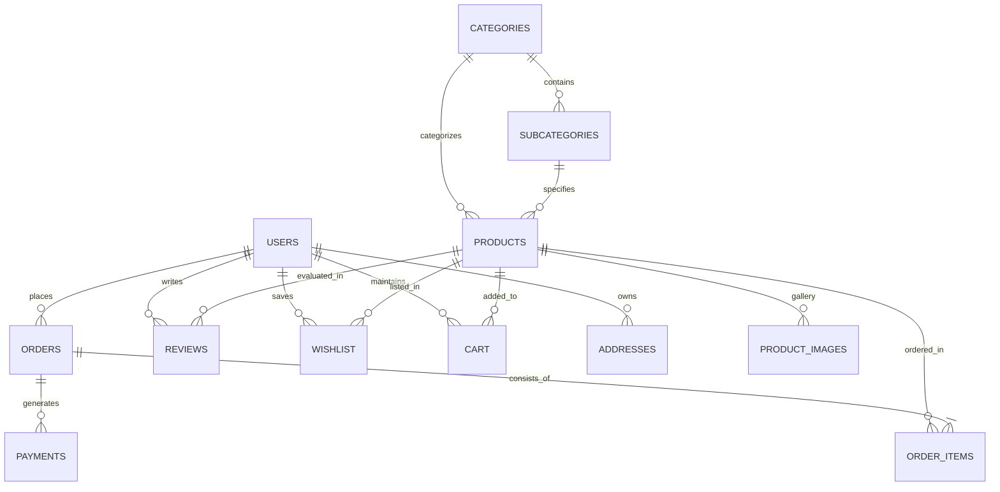

# Database Schema & Entity Relationship Documentation

## Overview
The AA Mart database is designed on MySQL/MariaDB with 18 normalization-compliant tables, using InnoDB storage engine to enforce foreign key integrity, cascade operations, and indexed search optimization.

## Entity Relationship Diagram (Mermaid)

## Table Specifications & Relationships

### 1. `users`
- Primary Key: `id` (AUTO_INCREMENT)
- Key Fields: `email` (UNIQUE), `password` (BCRYPT hash), `role` (`user`, `admin`), `status` (`active`, `inactive`, `banned`).

### 2. `admin_users`
- Primary Key: `id` (AUTO_INCREMENT)
- Key Fields: `email` (UNIQUE), `password` (BCRYPT hash), `role` (`superadmin`, `admin`, `editor`).

### 3. `categories` & `subcategories`
- `subcategories.category_id` references `categories.id` ON DELETE CASCADE.

### 4. `products` & `product_images`
- `products.category_id` references `categories.id` ON DELETE CASCADE.
- `products.subcategory_id` references `subcategories.id` ON DELETE SET NULL.
- `product_images.product_id` references `products.id` ON DELETE CASCADE.

### 5. `cart` & `wishlist`
- `cart.user_id` references `users.id` ON DELETE CASCADE.
- `cart.product_id` references `products.id` ON DELETE CASCADE.
- `wishlist.user_id` references `users.id` ON DELETE CASCADE.

### 6. `orders`, `order_items` & `payments`
- `orders.user_id` references `users.id` ON DELETE SET NULL.
- `order_items.order_id` references `orders.id` ON DELETE CASCADE.
- `payments.order_id` references `orders.id` ON DELETE CASCADE.

### 7. `reviews`, `coupons`, `addresses`, `contact_messages`, `newsletter`, `hero_slides`, `settings`
- Manage promotional codes, user address defaults, contact feedback, subscriber list, hero banners, and site key-value configurations.
